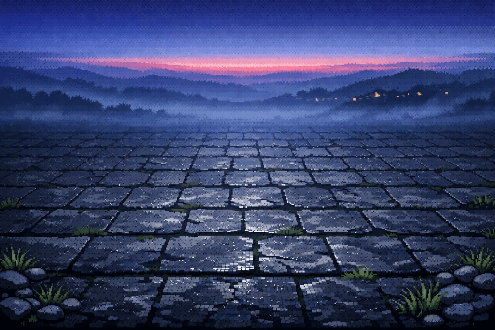

# Act 1 — Border Roads — review log

## v2 (current — 2026-04-30)

**Generated:** 2026-04-30 via `gpt-image-1.5`. 1536×1024, ~$0.04, 21s. Used the amended prompt with the new "no architectural framing on lateral edges" negative-prompt block (now on every act prompt).

**File:** [`act-1-border-roads-v2.png`](act-1-border-roads-v2.png)

### Phase 5 acceptance checklist (v2)

| Criterion | Pass? | Notes |
|---|---|---|
| 80/20 ground/sky split | ✅ | Reads ~74/26. The sunset horizon band slightly bigger than spec but pleasant. |
| Perspective converges to upper-center 15% | ✅ | Clean convergence; tiles foreshorten cleanly into the vanishing point. |
| Biome accuracy (Border Roads) | ✅ | Distant rolling hills + far torch points = definitive frontier read. |
| Lighting clarity | ✅ | Warm orange horizon + cool blue night, soft vignette upper-corners. |
| Midground empty | ✅ | Playfield is fully clear of obstacles. Skull / bones / grass tufts only at lower corners. |
| No characters | ✅ | None. |
| No UI / text / watermark | ✅ | Clean. |
| Color palette match | ✅ | Hits `#1a1128`, `#c8a020`, `#2e2438` anchors. |
| **No architectural framing on lateral edges (v2 new)** | ✅ | **Fixed.** Ground extends fully to image edges; no walls, archways, or pillars flanking the playfield. |

**9/9 pass.** This is approved as the recipe for the remaining acts.

### What changed v1 → v2

- Stone walls + side torches on lateral edges removed entirely.
- Sky simplified — no individual visible torches in distance, just one warm horizon band + soft star scatter. Far easier to read turn-order chips against.
- Vignette moved from corners-all-around to upper-corners-only, keeping the playfield bottom edge bright.
- Foreground props (skull, bones, grass tufts) now decorate the lower-corner safe zones instead of being scattered across the midground.

### Pairs cleanly with Phase 4 amendment

`phases/04-grid-camera.md` was also amended (2026-04-30) from 8 cols → 6 cols. The 6-col grid sits comfortably inside the wall-free playfield; outer columns no longer risk clipping into framing architecture (and there isn't any framing anyway). Two-layer defense: the prompt forbids the architecture, and the grid is narrower so even if a future biome's prompt slips, columns stay on usable ground.

### Remaining minor concerns

1. Sky stars + thin clouds are still there — shouldn't fight turn-strip chips since chips will live in their own panel, not floating directly on the sky.
2. Lower-left has a skull and lower-right has a small grass tuft. These are decorative and stay clear of the 6-col grid footprint.

---

## v1 (deprecated — kept for reference)

**File:** [`act-1-border-roads.png`](act-1-border-roads.png)

8/9 pass. Failed: lateral architectural framing (stone walls on each side) clipped the outer columns of the planned 8-col grid. Replaced by v2 above.

---

## Decision

**Approved as the recipe.** Ready to generate the other 5 acts (~$0.20) using the same amended universal prompt template. The v2 image will be the canonical Act 1 background once the implementation milestones land. v1 will be archived (not deleted) as evidence of the framing-bug fix.
