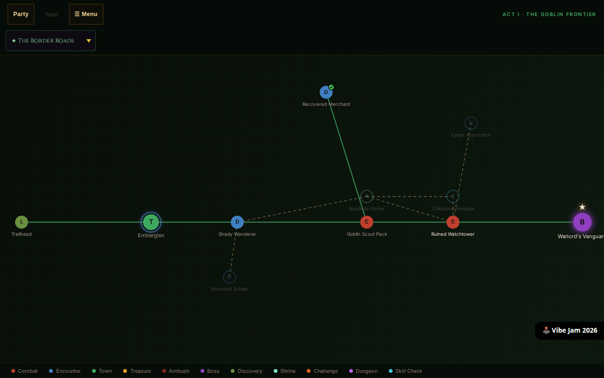
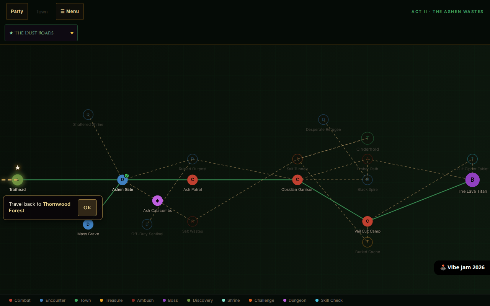
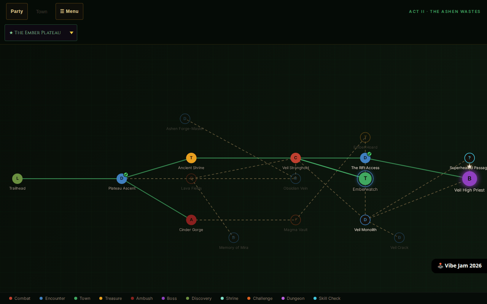
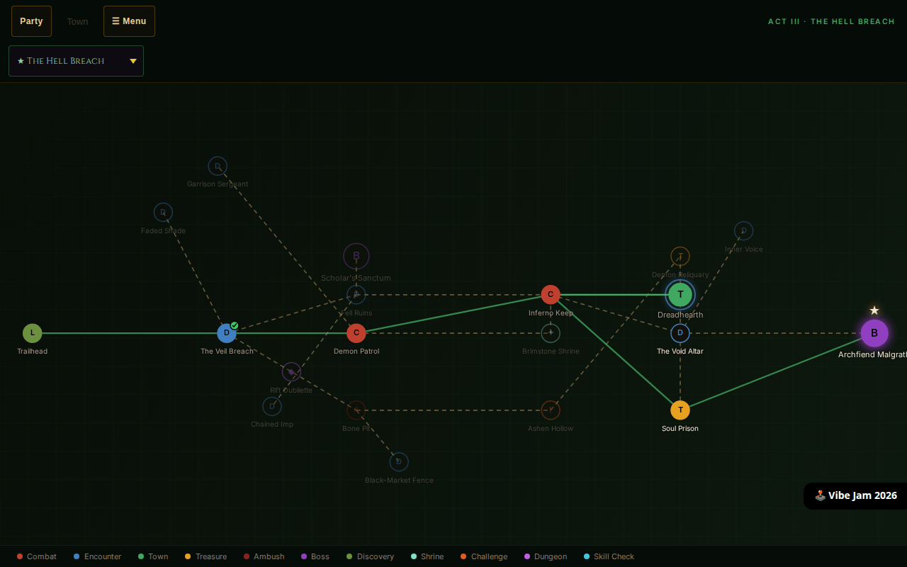
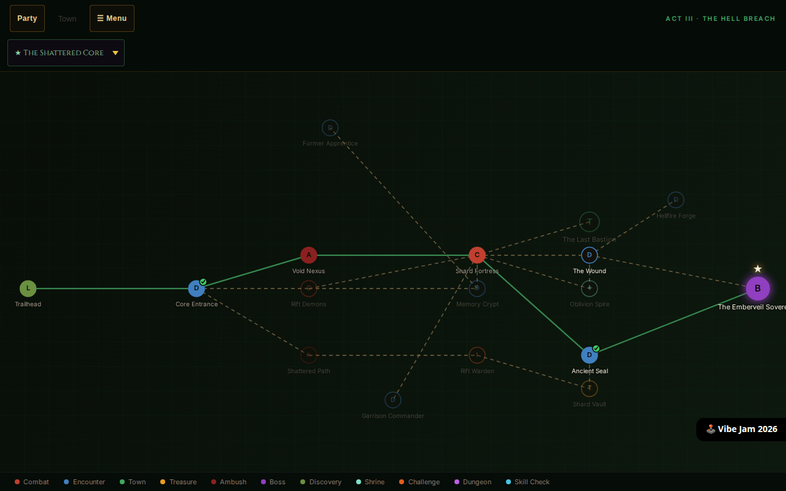
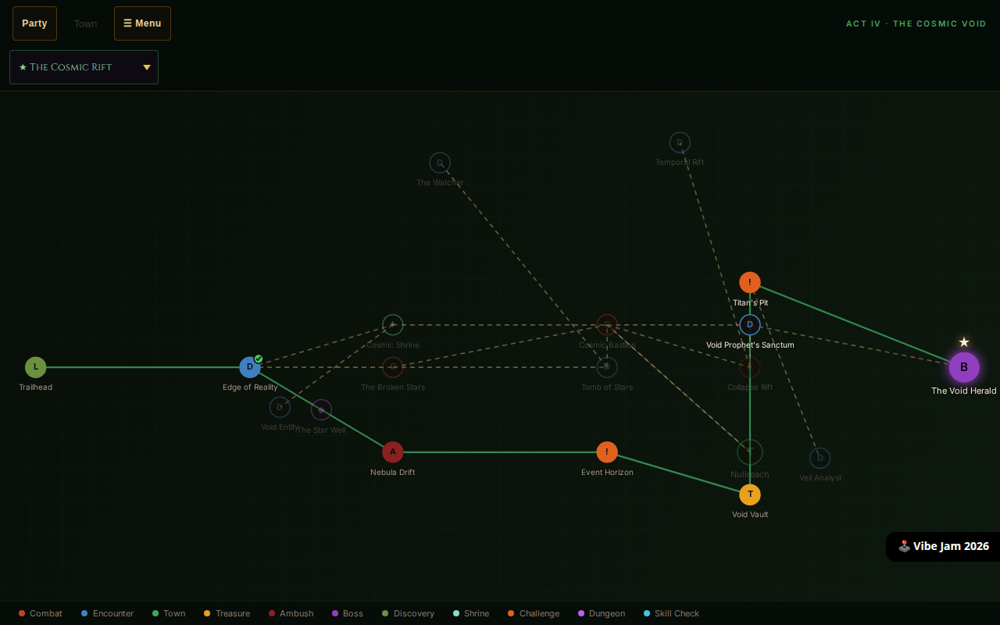
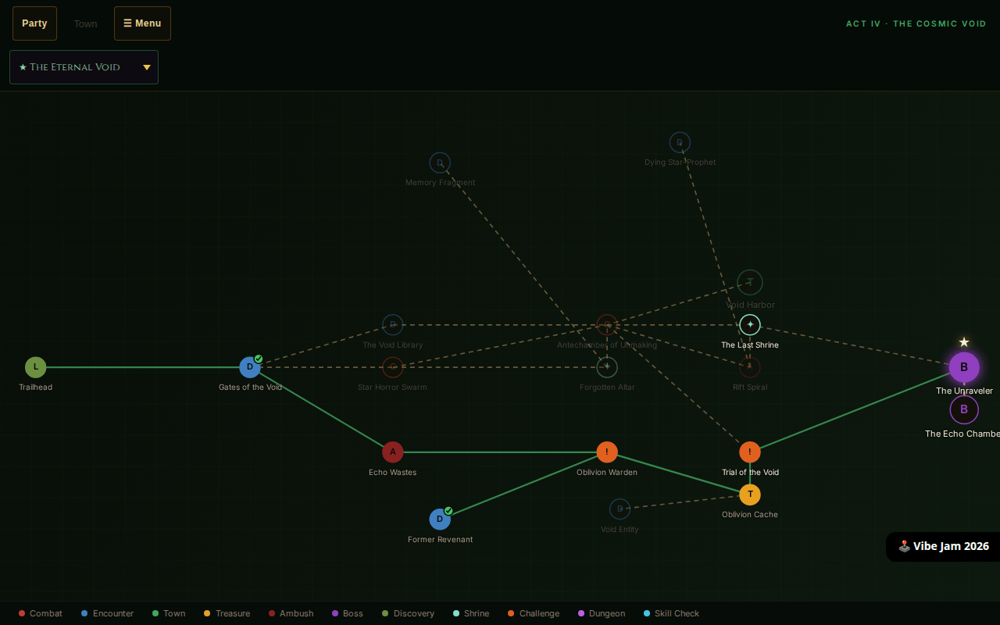
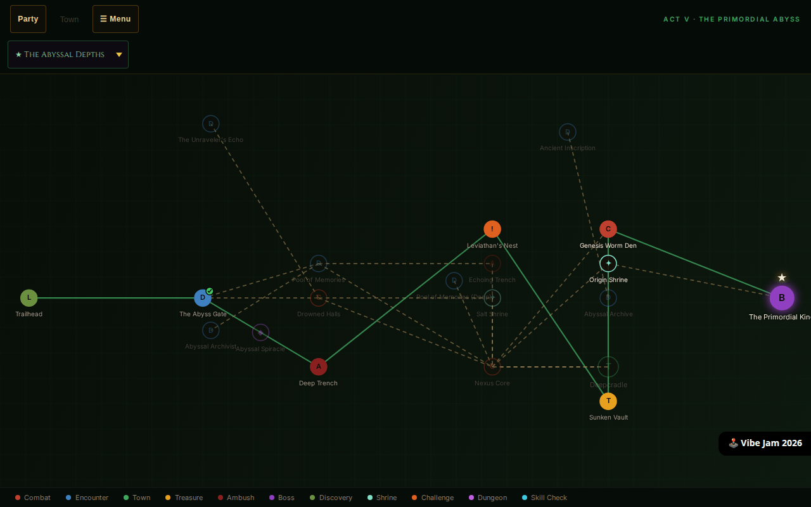
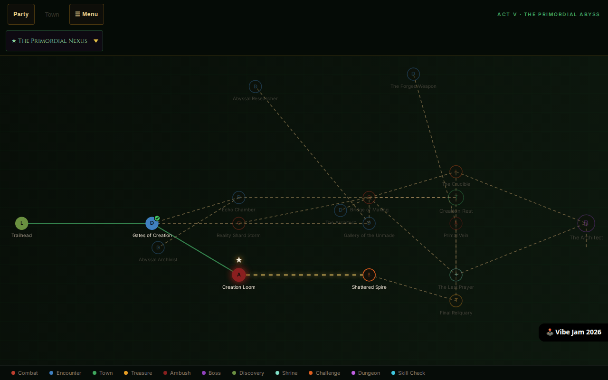

# Emberveil — Per-Act Map Screenshots

Captured 2026-04-29 via Playwright at 1280x800, fog of war disabled, all zones unlocked.
Source save: `emberveil-save-rouge_the_rogue-2026-04-27.json` (Act V / Primordial Nexus, level 60+).

---

## Act I — The Goblin Frontier

### Border Roads

### Dust Roads

---

## Act II — The Ember Wastes

### Ember Plateau

### Hell Breach

---

## Act III — The Shattered Realm

### Shattered Core

### Cosmic Rift

---

## Act IV — The Cosmic Void

### Eternal Void

### Abyssal Depths

---

## Act V — The Primordial Abyss

### Primordial Nexus

