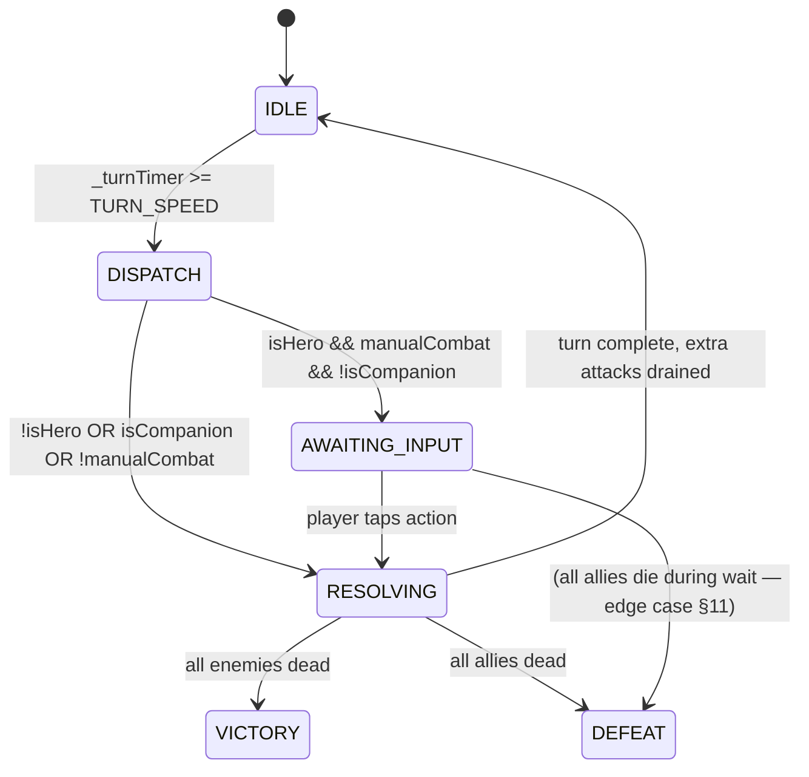

# Phase 02 — Manual Mode Game Loop Design

**Author:** game-developer agent
**Date:** 2026-04-29
**Feeds:** Phase 03 (IA States), Phase 04 (Grid/Camera), Phase 06 (Card Rail)

---

## 1. Mode Selection Surface

### Recommendation: Settings toggle, active immediately; pre-combat banner confirmation

**Where:** `Settings` screen — a toggle labeled "Combat Mode: Auto / Manual." This is the right
home for three reasons:

1. The player may want to switch mid-campaign (not just before a specific fight), and the Settings
   screen is already the canonical persistent-preference surface.
2. Adding a per-combat prompt would interrupt the flow of the dungeon; adding it to the
   difficulty dialog only surfaces it once (and then buries it).
3. The toggle persists to the save (see §10), so veteran players don't re-confirm it every
   session.

**Pre-combat banner (non-blocking):** When the player enters a combat encounter and `manualCombat`
is `true`, show a 2-second non-blocking toast at the top of the battlefield:
`"Manual Mode — tap your action when your character's card pulses."` Dismissable by tap.
This replaces the need for a modal confirmation gate.

**Hardcore lock (clarified post-roast 2026-04-30):** On Hardcore saves, the Settings
toggle is **shown but visibly disabled with a lock icon and inline tooltip "Hardcore —
Manual only"** — it is NOT hidden. (The earlier "hidden" phrasing here was contradicted
by Phase 03 §8/§10 which spec the locked-pill visual; the locked-pill version is
canonical.) `gs.manualCombat = true` is forced on save load for hardcore saves;
clicking the disabled toggle is a no-op.

---

## 2. Action Types

| Action | Effect | Consumes Turn | Formula Contract |
|---|---|---|---|
| **Basic Attack** | Melee or ranged attack on selected target | Yes | Same path as `_basicAttack(actor, target)` — `CombatScreen.js:~3000+`. Hit roll → block → mitigation → `_applyDamage`. |
| **Cast Spell** | Use a skill from the character's skill list | Yes | Same path as `_executeSkill(actor, skill, target)` — `CombatScreen.js:~3200+`. MP cost deducted, cooldown set, formula unchanged. |
| **Use Item** | Consume an item from the potion belt | **No (free action)** | Calls the same item-resolve path as `resolveTap()` in `tapWeapons.js`. Does NOT advance the turn. Card rail remains hot after item use. |
| **End Turn (Skip)** | Do nothing; pass to the next actor | Yes | No formula call. Logs "X holds their action." |
| **Flee** | Attempt to escape the encounter | Yes | Same DEX check as today. On success: combat exit. On failure: logged, turn consumed. |

**Notes:**
- "Wait" (move to end of round) is defined in §8 as a separate option from Skip.
- Multi-attack auto-fire is not a player-visible action; it is an automatic sequel to
  Basic Attack or Cast Spell (see §5).
- Items used as free actions must still check if the potion belt is exhausted; if empty,
  the action slot shows a disabled "No items" state.

---

## 3. Manual Turn Lifecycle

### Overview

Today's turn loop calls `_heroAI(actor)` unconditionally for hero-side actors
(`CombatScreen.js:2573`). Manual mode intercepts this with a new method,
`_pauseForPlayerInput(actor)`, which sets a flag and returns. The `update(dt)` loop
then halts timer accumulation for that actor's turn until the flag is cleared by
a player action dispatch.

### State Machine

```
           ┌────────────────────────────────────────────────────────────┐
           │                       IDLE                                 │
           │  _turnTimer accumulates (TURN_SPEED = 0.5s)               │
           │  _awaitingInput === null                                   │
           └──────────────────────────┬─────────────────────────────────┘
                                      │ _turnTimer >= TURN_SPEED
                                      │ _executeTurn() pops actor
                                      ▼
           ┌────────────────────────────────────────────────────────────┐
           │             DISPATCH (internal, not a dwell state)         │
           │  actor.isHero?                                             │
           │    └─ isCompanion? → auto-resolve via pickHeroAction()     │
           │    └─ manualCombat? → _pauseForPlayerInput(actor)  ──────► AWAITING-INPUT
           │  !actor.isHero → _enemyAI(actor)                  ──────► RESOLVING
           └────────────────────────────────────────────────────────────┘
                                      │
           ┌───────────────────────────────────────────────────┐
           │                  AWAITING-INPUT                   │
           │  _awaitingInput = actor (the hero whose turn it is│
           │  _turnTimer FROZEN (not incremented in update)    │
           │  Card rail: active hero's buttons are HOT         │
           │  Enemy targets: tappable (phase 06 resolves tap)  │
           │  Other heroes' buttons: COLD                      │
           │                                                   │
           │  Player taps an action button:                    │
           │  → _dispatchManualAction(actor, action, target)   │
           │  → _awaitingInput = null                          │
           └──────────────────────┬────────────────────────────┘
                                  │ action dispatched
                                  ▼
           ┌────────────────────────────────────────────────────────────┐
           │                    RESOLVING                               │
           │  _executeSkill / _basicAttack runs synchronously           │
           │  Multi-attack extra turns auto-drain (§5)                  │
           │  _checkCombatEnd() called                                  │
           │  If combat ends → VICTORY or DEFEAT (terminal)             │
           │  Else: advance _turnIdx, reset _turnTimer                  │
           └──────────────────────┬─────────────────────────────────────┘
                                  │ all extra attacks exhausted
                                  ▼
                              back to IDLE
                         (next actor's turn begins)
```

**Mermaid equivalent:**



### Code anchors

| State | Location today | What changes |
|---|---|---|
| `IDLE` | `update(dt)` accumulator at `CombatScreen.js:2438` | Add guard: `if (this._awaitingInput) return;` **specifically before the `_turnTimer += dt * (this._speedMult \|\| 1)` line at :2438**, NOT earlier in the function. Earlier placement freezes spellFx particles + floating damage numbers + barrier regen ticks during player thinking, which looks broken. _Roast §4 clarification (2026-04-30)._ When the guard fires, do NOT reset `_turnTimer` — preserve the accumulator so a 0.4s in-flight tick resumes mid-fraction when input clears. Only reset `_turnTimer = 0` inside `_dispatchManualAction()` after the action resolves. |
| `DISPATCH` | `_executeTurn()` at `CombatScreen.js:2573` | Replace `_heroAI()` call for manual heroes with `_pauseForPlayerInput(actor)` |
| `AWAITING-INPUT` | New method `_pauseForPlayerInput(actor)` | Sets `this._awaitingInput = actor`, fires card-rail highlight event |
| `RESOLVING` | `_executeSkill` / `_basicAttack` + extra-attack drain (§5) | Add `_drainExtraAttacks(actor)` call after primary action |

---

## 4. Input Gating

### Source of truth: `_awaitingInput`

A single instance-level field: `this._awaitingInput: CombatantObject | null`.

- `null` = no player input expected. All card-rail buttons are COLD.
- non-null = the specific actor awaiting input. Only that actor's card-rail buttons are HOT.

**Why one field, not a per-character boolean?**
The turn order is strictly sequential. Two heroes cannot both be awaiting input at the same
time — one always resolves before the next fires. A per-character flag would require clearing
all flags on combat end, pause, or flee; a single nullable field is atomic and unambiguous.

### Gating rules for the spell rail (phase 06 contract)

```
button.isHot =
  this._awaitingInput !== null                  // combat is paused for input
  && this._awaitingInput.id === card.actorId    // this card belongs to the active hero
  && !button.spell.isOnCooldown(actor)          // not on cooldown
  && actor.mp >= button.spell.mpCost            // enough mana
  && !actor.hasSilence                          // not silenced (see §11)
```

The Use Item button ignores spell-specific conditions but still requires
`_awaitingInput.id === card.actorId`.

**Cold state** = buttons receive pointer-events: none + visual dimming (see phase 06).
**Hot state** = full opacity, pointer cursor, hover highlight enabled.

### Turn-strip chips

All turn-strip portrait chips are always visible. The chip for `_awaitingInput` actor
gets a pulsing gold outline (CSS keyframe). No chip is clickable for input — chips
are purely informational.

---

## 5. Multi-Attack Consolidation

### Current problem (from phase 01 §4)

Two splice-back mechanisms fire after `_heroAI()` at `CombatScreen.js:2549` (extraAction)
and `CombatScreen.js:2559` (_speedExtraRemaining). In auto mode these cause the actor to
be re-inserted into the turn order and get another AI call. In manual mode this would
demand a second player prompt — which must not happen.

### Algorithm: `_drainExtraAttacks(actor, primaryTarget)`

Called immediately after `_executeSkill` or `_basicAttack` resolves, still inside
`RESOLVING` state. No player input is requested.

```
function _drainExtraAttacks(actor, primaryTarget):
  while actor.extraAction > 0 OR actor._speedExtraRemaining > 0:

    // Determine which counter fires (extraAction takes priority)
    if actor.extraAction > 0:
      actor.extraAction--
      attackLabel = "extra action"
    else:
      actor._speedExtraRemaining--
      attackLabel = "fast weapon"

    // Resolve target: use primaryTarget if alive, else re-target via AI helper
    target = primaryTarget.hp > 0
      ? primaryTarget
      : pickBestTarget(actor, liveEnemies)   // existing AI helper from _aiTargeting.js

    if target is null: break   // no valid targets (combat end imminent)

    // Auto-fire basic attack (silent AI path — NOT _heroAI, directly _basicAttack)
    _basicAttack(actor, target)

    // Visual feedback: pulse the actor's sprite + stack the damage number
    _pulseExtraAttack(actor)    // new helper: CSS class toggle, 100ms

    // Increment the pendingTurns extension hook (§5b below)
    // In v1 this is a no-op; the drain consumes it immediately.
    // The hook exists so future "bonus turn" can leave it > 0 instead.
    actor.pendingTurns = max(0, actor.pendingTurns - 1)

  // Remove both splice-backs from _executeTurn so they do NOT fire in this context.
  // In auto mode, the existing splice-back paths remain active (they run _heroAI,
  // which is NOT called for manual heroes). The splice-backs at CombatScreen.js:2549
  // and CombatScreen.js:2559 must be guarded:
  //   if (!this._isManualHero(actor)) { ... splice ... }
```

### No re-targetting prompt

The player is never asked to pick a new target for extra attacks. If the primary target
dies during the first hit, `pickBestTarget()` from `_aiTargeting.js` silently selects the
next best enemy. A log line is appended: "Alice strikes again at Goblin Archer (fast weapon)!"

### Visual communication

- The actor's sprite plays `_pulseExtraAttack()`: a 100ms scale bounce (CSS keyframe,
  `transform: scale(1.08)` then back). No new art required.
- Damage numbers stack vertically above the target (the existing floating-number system
  already handles rapid sequential spawns — no change needed).
- The card rail shows a brief indicator under the actor's card: "x2 attack" or "x3 attack"
  as plain text, fades after 600ms.

### Future bonus-turn extension hook

Each combatant gets a field `pendingTurns: 0` (initialized in `_memberToCombatant`).

In v1 (the drain algorithm above), `pendingTurns` is decremented to zero inside the while
loop. Net effect: identical to today's behavior, just without the splice-back.

When the future "bonus turn" feature ships: instead of auto-draining, `_executeTurn` checks
`actor.pendingTurns > 0` after the primary action. If true, it sets `_awaitingInput = actor`
again (re-entering `AWAITING-INPUT`) and decrements `pendingTurns`. The player gets a real
second input prompt. No structural changes to the loop are needed — only the drain policy
inside `_drainExtraAttacks` changes.

---

## 6. Companion Handoff

### Existing gate (confirmed correct)

`CombatScreen.js:2585`:

```js
if (gs.manualCombat && actor.isHero && partyMember
    && !(partyMember.isCompanion || partyMember.class === 'companion')) {
  this._openManualActionPanel(...);
  return;
}
```

This gate will be kept verbatim except `_openManualActionPanel(...)` is replaced with
`_pauseForPlayerInput(actor)`. Companions hit the else path and fall through to
`pickHeroAction()` as in auto mode. No change to companion behavior.

### `partyMember` lookup fragility (`CombatScreen.js:2575`)

Current code:

```js
const partyMember = [...gs.party, ...gs.companions].find(m => m.id === actor.id);
```

Risk: if a companion's `id` field was set differently during `_memberToCombatant` (e.g.
slugified name vs UUID), the find returns `undefined`, and `partyMember` is falsy. The
gate expression `&& partyMember` evaluates false, causing the companion to skip the manual
prompt (which is the correct behavior) — but it gets there via undefined rather than the
`isCompanion` check. This masks the bug and could break if the condition ever changes.

**Proposed 2-line fix (to apply in M390):**

```js
const partyMember = [...gs.party, ...gs.companions].find(m => m.id === actor.id);
const isPlayerControlled = actor.isHero && partyMember && !partyMember.isCompanion
                           && partyMember.class !== 'companion';
```

Replace the compound `&&` inline condition with `isPlayerControlled`. The gate becomes:

```js
if (gs.manualCombat && isPlayerControlled) {
  _pauseForPlayerInput(actor);
  return;
}
```

This is explicit, auditable, and catches future companion-class expansions cleanly.

---

## 7. Combat-End Conditions

Unchanged from today. Documented for phase 12 verification.

| Condition | Trigger | Result |
|---|---|---|
| All enemies HP <= 0 | `_checkCombatEnd()` at `CombatScreen.js:4601` | `_phase = 'VICTORY'`, 800ms delay, `_victory()` |
| All allies HP <= 0 | Same | `_phase = 'DEFEAT'`, 800ms delay, `_defeat()` |
| Flee success | DEX check in End Turn / Flee action | Immediate combat exit |
| Flee fail | Same | Turn consumed, combat continues |

`_checkCombatEnd()` is called at the tail of `RESOLVING` state, after `_drainExtraAttacks`
completes. If a combat-end condition is met mid-drain (e.g. the third extra attack kills the
last enemy), the while loop in `_drainExtraAttacks` exits via `target is null`, and the
function returns. `_checkCombatEnd()` then fires normally.

If `_awaitingInput` is non-null when a combat-end condition triggers (e.g. an enemy DoT
kills the last ally during the player's input window), `_awaitingInput` is cleared and the
DEFEAT path fires. The card rail goes cold.

---

## 8. Skip / Wait / Flee

| Option | Behavior | Turn consumed | Notes |
|---|---|---|---|
| **Skip (End Turn)** | No action. Advance to next actor. | Yes | Log: "X waits." No formula call. |
| **Wait** | Move actor to end of current round's initiative queue. | No (deferred) | Re-insert actor at `_turnOrder.length - 1` before incrementing `_turnIdx`. Actor acts again at end of round if any slots remain. Consumed at that point. |
| **Flee** | DEX check (existing path). | Yes on failure; exits on success | Same as today. Flee is only available if encounter flags allow it (boss encounters block flee). |

**Wait semantics detail:** "Wait" is not in the original confirmed action set from phase 00
(which lists only: Cast Spell, Basic Attack, Use Item, End Turn / Skip, Flee). Raising it
here as an explicit option for Phase 03 (IA) to confirm or cut. If cut, it does not
appear in the card rail. Skip (no-op End Turn) is the confirmed minimum.

---

## 9. Animation Timing

### Target

Input-to-resolution latency: <= 200ms from button tap to first visual response
(damage number, spell FX, or attack animation kick).

### How TURN_SPEED interacts with AWAITING-INPUT

`TURN_SPEED = 0.5s` is the tick rate for the turn loop. In `update(dt)`:

```js
if (this._awaitingInput) return;   // FROZEN — do not accumulate _turnTimer
```

The timer is completely frozen while awaiting input. There is no timeout. The player can
take as long as they need. The timer resumes only after `_awaitingInput` is cleared
(action dispatched) and the RESOLVING state completes.

**Implication:** In manual mode, TURN_SPEED is irrelevant to the player's action cadence.
It only controls the auto-resolve cadence for companions and enemies, which still fire at
0.5s between turns when no human input is needed.

### Companion/enemy resolution speed in manual mode

Companions and enemies resolve at the same TURN_SPEED as today (0.5s). This means
between player turns, the game may play through several AI turns in rapid succession.
This is intentional — the wait is the player's own decision time, not AI wait time.
Consider lowering enemy turn resolution to 0.3s in manual mode so AI turns feel
snappier between player decisions. This can be a setting ("Enemy Speed: Normal / Fast")
rather than hardcoded.

### Resolution path timing budget

```
Player taps button          t = 0ms
_dispatchManualAction()     t = 0ms     (synchronous, no async gap)
_executeSkill or            t < 5ms     (pure JS, no I/O)
  _basicAttack()
_applyDamage()              t < 10ms
Floating damage number      t < 50ms    (already frame-scheduled via requestAnimationFrame)
Spell FX CSS class toggle   t < 16ms    (next paint frame)
Card rail goes cold         t < 16ms    (CSS class swap, next frame)
```

The 200ms budget is comfortably met. No async delays are introduced in the dispatch path.

---

## 10. Settings Persistence

### Field name

`gameState.combatMode: 'auto' | 'manual'`

This mirrors the existing `gameState.combatSpeed` pattern (a named string field on the
root save object, not a nested preference object).

**Audit closed (post-roast 2026-04-30):** `gs.manualCombat` is already persisted —
declared at `gameState.js:141` as `manualCombat: false`. It serializes via
`toSaveData()` and restores on `load()` like every other root field. **Reuse it
directly; do NOT add a new `combatMode` field.** Hardcore mode forces
`gs.manualCombat = true` on save load (one line in the load path); the user-facing
toggle in Settings simply flips this boolean.

The naming change recommended above (`combatMode`) is **rejected** in favor of the
existing field. Updates required across this doc: every reference to `combatMode`
should read `manualCombat`. (Listed for the implementation milestone; not blocking
the design.)

### Default

`'auto'` — preserves current behavior for all existing saves.

### Migration

On save load, if `combatMode` is absent: `combatMode = 'auto'`. One-line migration in
the save-load path. No data loss risk.

### Hardcore lock persistence

For Hardcore saves, `combatMode` is forced to `'manual'` on every load after the
difficulty field is read. The Settings toggle reads `gs.difficulty === 'hardcore'` to
decide whether to render the lock icon.

---

## 11. Edge Cases

The following must all be handled. Implementation agent: treat each as a test case.

1. **Silenced hero during input window.** If a DoT or on-hit effect applies Silence to the
   waiting hero before they choose, all spell buttons must go cold immediately (the
   `hasSilence` check in the gating formula is evaluated at render time, not at pause time).
   Basic Attack, Use Item, Skip, and Flee remain available.

2. **Stunned actor before their turn.** The stun/freeze check at `CombatScreen.js:2477`
   fires before `_heroAI`. Manual mode inherits this — stunned actors skip without entering
   AWAITING-INPUT. No player prompt is shown.

3. **All spells out of mana.** All spell buttons show disabled state (grey, not hidden).
   Basic Attack and Use Item remain available. Skip is always available as fallback.

4. **All enemies dead before player acts.** If `_checkCombatEnd()` detects victory before
   the player's turn fires (e.g. a companion kill on the prior tick), `_awaitingInput` is
   never set. The victory path fires normally. No zombie awaiting-input state.

5. **All allies dead during player input window.** A companion or DoT effect kills the last
   ally while `_awaitingInput` is set. `_checkCombatEnd()` must be called after every
   `_applyDamage()` call regardless of who triggered it. Clear `_awaitingInput` and enter
   DEFEAT.

6. **Polymorph / confused on the waiting hero.** Confused actors at `CombatScreen.js:2477`
   may attack a random target including allies. In manual mode, confused actors skip the
   AWAITING-INPUT state entirely and resolve via AI (same as stun path). The card rail shows
   a "Confused!" status badge but no action buttons.

7. **Taunt forcing target.** If a Taunt status restricts the valid target set, the player
   must only see tauntable enemies as selectable. Phase 06 (card rail) must filter the
   target set based on actor status before rendering target-select affordances.

8. **Mid-input game pause (ESC).** If the player opens the ESC pause menu while
   `_awaitingInput` is set, `_turnTimer` is already frozen. The pause menu overlay covers
   the card rail. On resume, `_awaitingInput` is still set; the card rail re-activates.
   No state loss.

9. **Switching screens mid-turn.** If the player navigates away from CombatScreen (e.g.
   via a system back gesture on mobile), `_awaitingInput` must be cleared and combat
   paused (or the navigation must be blocked). Recommend blocking navigation during combat
   the same way the current `onExit` guard works.

10. **"Wait" then immediately stunned.** Player selects Wait, actor is re-inserted at end
    of initiative. Before their deferred turn fires, a status effect stuns them. The stun
    check at turn dispatch fires and skips the turn. Correct behavior — no special case
    needed.

11. **Companion dies during player's input window.** Does not affect `_awaitingInput`. The
    combat end check runs on the companion's death; if allies still live, play continues.
    The dead companion's card enters dead-state CSS. The player's input window remains open.

12. **Multi-attack kills mid-drain.** During `_drainExtraAttacks`, the nth extra attack
    kills the last enemy. `target = pickBestTarget(...)` returns null. The while loop
    exits. `_checkCombatEnd()` fires. VICTORY state. No dangling `_awaitingInput`.

13. **Use Item with empty belt.** Player taps Use Item; belt is empty. The action panel
    should show "No items" and not dispatch any action. `_awaitingInput` remains set.
    Player must choose another action.

---

## 12. Open Implementation Questions for Phases 4 and 6

1. **Target selection affordance (Phase 06).** When the player taps "Basic Attack" or a
   single-target spell, does the card rail immediately enter a "pick target" mode where
   enemy sprites become tappable? Or is the target assumed to be the default AI target and
   confirmed in one tap? Phase 06 must lock the tap model before the card rail is built.

2. **AOE spell targeting (Phase 06).** AOE skills hit all enemies by definition. Should the
   card rail show a "Confirm cast?" secondary prompt, or auto-target all enemies on a single
   tap? If a separate confirm step exists, it must complete within the 200ms budget.

3. **Turn-order strip tappability (Phase 04).** Phase 00 §9 item 6 asked whether tile grid
   events are wired but ignored in v1 or completely absent. Same question for turn-order
   chips: are they ever tappable to inspect a unit's stats, or purely decorative? This
   affects whether the strip needs pointer-events at all.

4. **Awaiting-input visual on the battlefield (Phase 04).** Phase 00 §9 item 8 notes the
   active-turn highlight (glow ring). When `_awaitingInput` is set, should the active
   hero's sprite have an additional "awaiting player" pulse distinct from the standard
   "active turn" highlight? Needs a design decision before the grid highlight system is
   specced.

5. **Enemy sprite tap handling for target selection (Phase 04 + 06).** The 2.5D grid will
   position enemy sprites at computed XY coordinates on canvas. If the player must tap an
   enemy to select them as a target, hit-testing requires either: (a) DOM overlays
   positioned over canvas sprites, or (b) canvas hit-testing. Phase 04 must declare which
   approach it uses; Phase 06 must design the target-select flow accordingly.

6. **`gs.manualCombat` — runtime vs persisted (Phase 04 / M390).** Confirm whether
   `gs.manualCombat` is a persisted save field or a computed runtime flag before M390
   implementation begins. This determines whether `combatMode` needs to be added to
   the save schema or already exists.

---

## Handoff to Phase 3 (IA States)

The manual mode game loop creates the following **distinct UI states** that Phase 3 must
map to screen shapes and layout variants:

| State name | Description | Visible UI change |
|---|---|---|
| `combat-auto` | Standard auto-battle, no player input expected | HUD shows passive status bars; no spell rail buttons hot |
| `combat-manual-idle` | Manual mode, AI-driven turn in progress (companion or enemy) | HUD cards all cold; turn-strip shows active actor chip pulsing |
| `combat-manual-awaiting` | Manual mode, player hero's turn — input required | Active hero's card pulses; spell buttons hot; enemy sprites may show target rings |
| `combat-manual-resolving` | Action dispatched, resolution animating, extra attacks draining | All buttons cold; damage numbers animating; "x2 attack" badge visible if extra attacks fire |
| `combat-manual-item` | Player tapped Use Item (free action) — turn still open | Item consumed; `_awaitingInput` unchanged; card rail re-arms |
| `combat-paused` | ESC menu open, `_awaitingInput` may be set | Combat overlay dimmed; pause menu modal on top |
| `combat-victory` | All enemies dead | Victory modal; card rail hidden |
| `combat-defeat` | All allies dead | Defeat modal; card rail hidden |
| `combat-flee-attempt` | Flee action in progress, awaiting DEX roll result | Brief animation; then either exit or return to `idle` |

Phase 3 should treat `combat-manual-awaiting` as the most complex screen state — it is the
only state where the bottom HUD is simultaneously informational (status bars) AND
interactive (spell rail hot). The tooltip card, target highlighting, and free-action
item slot all compete for attention in this state.
